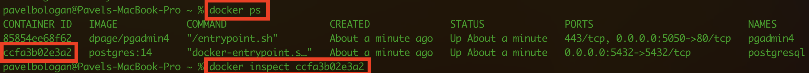
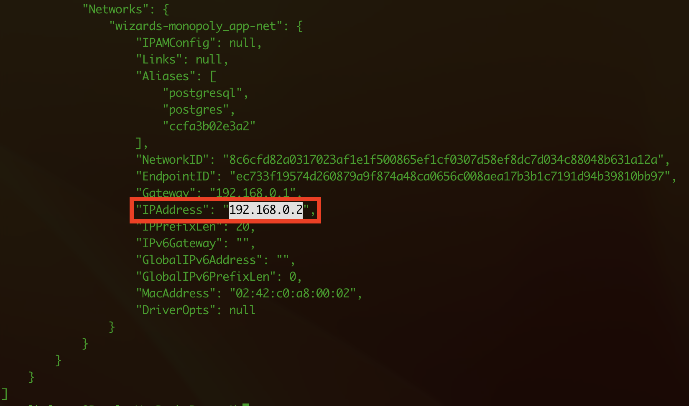
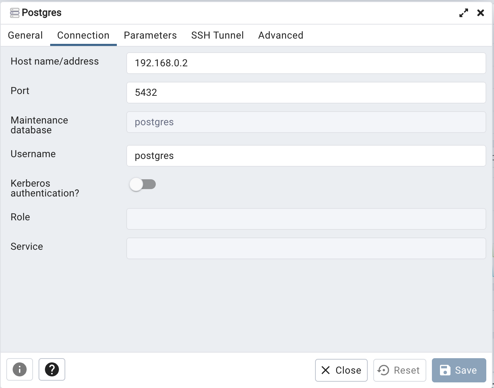

### Как запускать?

1. Убедитесь что у вас установлен `node` и `docker`
2. Выполните команду `yarn bootstrap` - это обязательный шаг, без него ничего работать не будет :)
3. Выполните команду `yarn dev`
3. Выполните команду `yarn dev --scope=client` чтобы запустить только клиент
4. Выполните команду `yarn dev --scope=server` чтобы запустить только server


### Как добавить зависимости?
В этом проекте используется `monorepo` на основе [`lerna`](https://github.com/lerna/lerna)

Чтобы добавить зависимость для клиента 
```yarn lerna add {your_dep} --scope client```

Для сервера
```yarn lerna add {your_dep} --scope server```

И для клиента и для сервера
```yarn lerna add {your_dep}```


Если вы хотите добавить dev зависимость, проделайте то же самое, но с флагом `dev`
```yarn lerna add {your_dep} --dev --scope server```


### Тесты

Для клиента используется [`react-testing-library`](https://testing-library.com/docs/react-testing-library/intro/)

```yarn test```

### Линтинг

```yarn lint```

### Форматирование prettier

```yarn format```

### Production build

```yarn build```

И чтобы посмотреть что получилось


`yarn preview --scope client`
`yarn preview --scope server`

## Хуки
В проекте используется [lefthook](https://github.com/evilmartians/lefthook)
Если очень-очень нужно пропустить проверки, используйте `--no-verify` (но не злоупотребляйте :)

## Ой, ничего не работает :(

Откройте issue, я приду :)

## Автодеплой статики на vercel
Зарегистрируйте аккаунт на [vercel](https://vercel.com/)
Следуйте [инструкции](https://vitejs.dev/guide/static-deploy.html#vercel-for-git)
В качестве `root directory` укажите `packages/client`

Все ваши PR будут автоматически деплоиться на vercel. URL вам предоставит деплоящий бот

## Production окружение в докере
Перед первым запуском выполните `node init.js`


`docker compose up` - запустит три сервиса
1. nginx, раздающий клиентскую статику (client)
2. node, ваш сервер (server)
3. postgres, вашу базу данных (postgres)

Если вам понадобится только один сервис, просто уточните какой в команде
`docker compose up {sevice_name}`, например `docker compose up server`

## Development окружение в докере
Перед первым запуском выполните команду `node init.js` из корневой директории проекта

Для начала необходимо запустить докер контейнеры с PostgreSQL и PgAdmin. Для этого необходимо выполнить команду `docker compose up postgres pgadmin` из корневой директории

Далее можно запускать сервер в режиме разработки, выполнив команду `yarn dev` из директории packages/server

Если при запуске контейнеров с базой данных возникают проблемы, попробуйте остановить контейнеры, затем удалите директорию tmp, выполните команду `node init.js` и снова запустите контейнеры

Для локального доступа к PgAdmin перейдите по адресу http://localhost:5050.
Логин: admin@admin.com, Пароль: admin

При добавлении сервера БД в PgAdmin, в поле Host name/address нужно указать IP адрес контейнера с БД, localhost не подойдёт.
IP можно найти следующим образом:
1. Находим container id, выполнив команду `docker ps`

2. Находим IPAddress контейнера, выполнив команду `dockder inspect {container_id}` как на скришоте выше

3. Вводим найденный IP в поле Host name/address в PgAdmin

Имя базы данных, имя пользователя и пароль можно найти в файле .env.sample по соответствующим ключам POSTGRES_DB, POSTGRES_USER,
POSTGRES_PASSWORD
